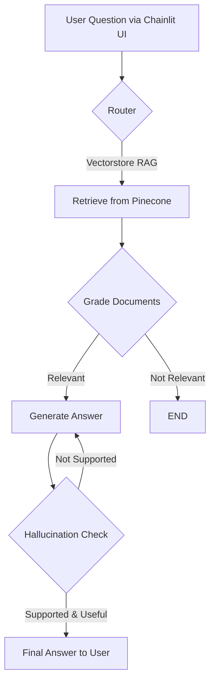

# AI clone for professional background (LangGraph + RAG)

An intelligent, interactive question-answering agent built to serve as my **Personal AI Clone**. It uses Retrieval-Augmented Generation (RAG) to answer questions about my background, skills, and projects based on a curated knowledge base (PDF resumes). Built with a modular, production-ready architecture.

---

## What Does This Project Do?

This project is designed for tech recruiters and developers to interactively learn about my profile. The autonomous agent:

1. **Reads your question** via a clean, web-based Chat UI (Chainlit).
2. **Searches a local knowledge base** (my JSON data stored in `data/` and indexed in Pinecone) for relevant facts.
3. **Evaluates the quality** of what it found — are the documents actually useful?
4. **Generates a concise, professional answer** using Groq's LLM (`llama-3.3-70b-versatile`).
5. **Self-checks for hallucinations** — if the answer isn't grounded in facts, it retries automatically.

---

## Architecture Overview



---

## Tech Stack

| Component         | Technology                                    | Purpose                                      |
|-------------------|-----------------------------------------------|----------------------------------------------|
| **UI Interface**  | Chainlit                                      | Modern ChatGPT-like web interface            |
| **LLM**           | Groq (`llama-3.3-70b-versatile`)              | High-speed language model for generation     |
| **Orchestration** | LangGraph + LangChain                         | Graph-based agent workflow                   |
| **Vector Store**  | Pinecone (Serverless)                         | Cloud storage for document embeddings        |
| **Embeddings**    | HuggingFace (`all-MiniLM-L6-v2`)              | Converts text to numerical vectors           |
| **Package Manager**| uv                                           | Ultra-fast Python dependency management      |

---

## Project Structure

```text
langgraph-rag-about-myself/
│
├── app_ui.py                        # Entry point — Run this to launch the Chainlit Chat UI
├── main.py                          # CLI testing entry point
├── pyproject.toml / uv.lock         # Project dependencies managed by `uv`
├── Dockerfile                       # Configuration for Hugging Face Spaces deployment
│
├── data/                            # Drop your JSON files here (e.g., resume.json, curious_facts.json)
│   └── resume.json 
│
└── src/
    ├── config/                      # Configuration and settings (LLM, prompts)
    ├── retrieval/                   # Reads JSONs, chunks them, and uploads to Pinecone
    ├── chains/                      # LangChain logic (Router, Generator, Graders)
    └── graph/                       # LangGraph workflow (Nodes, Edges, State)
```

---

## Setup & Installation

### Prerequisites

- **Python 3.13+**
- **uv** (Package manager) — [Install uv](https://docs.astral.sh/uv/getting-started/installation/)
- API Keys for **Groq**, and **Pinecone**.

### Step 1: Clone the Repository

```bash
git clone https://github.com/mauriciommendoza/langgraph-rag-about-myself.git
cd langgraph-rag-about-myself
```

### Step 2: Install Dependencies

```bash
uv sync
```

### Step 3: Configure Environment Variables

Create a `.env` file in the project root:

```env
GROQ_API_KEY="your_groq_api_key_here"
PINECONE_API_KEY="your_pinecone_api_key_here"
PINECONE_INDEX_NAME="about-myself-rag"
```

> **Smart Indexing:** Just drop your JSON files into the `data/` folder. The app automatically reads them, chunks them, and uploads them to Pinecone on launch. If vectors already exist, it skips the upload to save time.

### Step 4: Run the UI

```bash
uv run chainlit run app_ui.py --port 8080
```
This will open a browser tab with the chat interface.

*(For a quick terminal-only test without UI, you can use: `uv run main.py "Your question?"`)*

---

## Deployment (Hugging Face Spaces)

This project is pre-configured to be deployed for free on **Hugging Face Spaces**.

1. Create a new Space on [Hugging Face](https://huggingface.co/).
2. Select **Docker** as the environment.
3. Connect it to this GitHub repository.
4. Add your API keys (`GROQ_API_KEY`, etc.) in the Space Settings under **Variables and secrets**.
5. The included `Dockerfile` will automatically install `uv`, sync dependencies, and expose the app on port `7860`.

---

## 📄 License
This project is part of my personal AI portfolio. Feel free to explore the code!